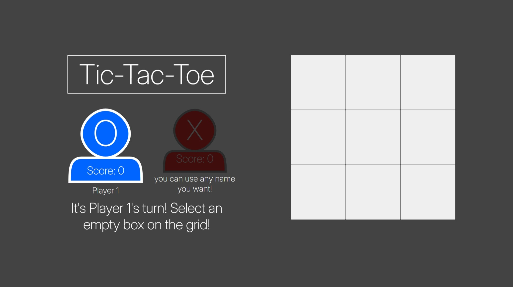
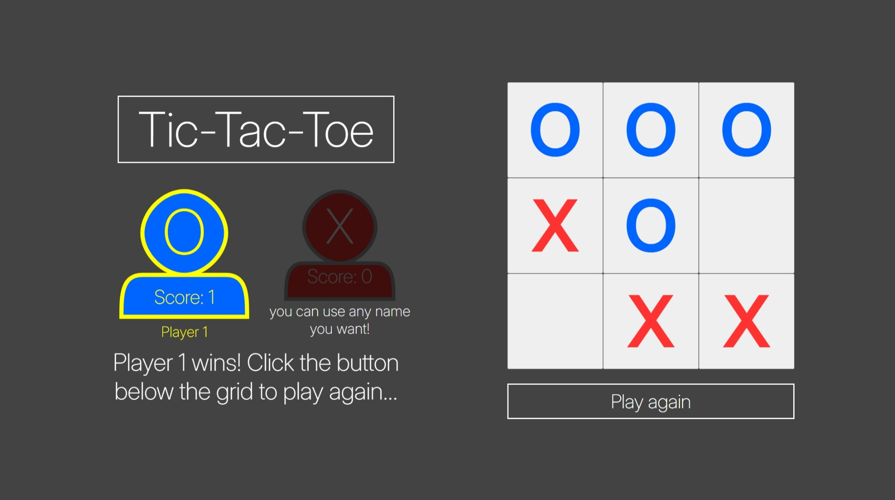
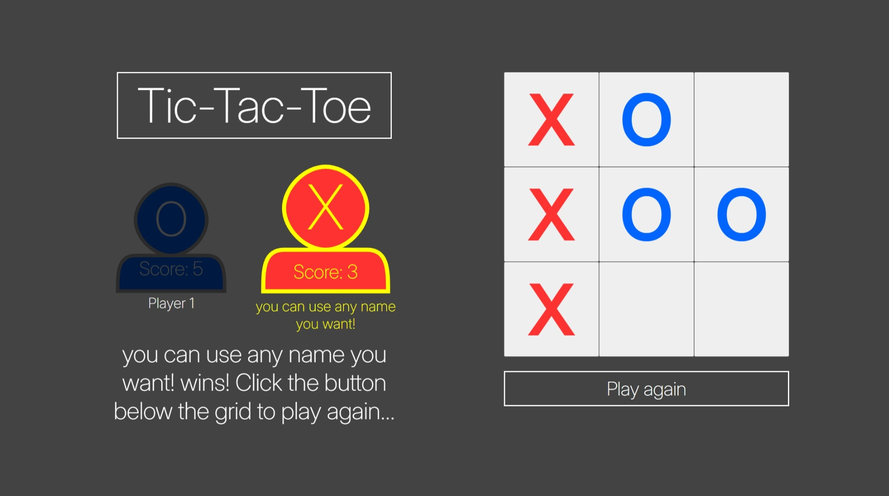
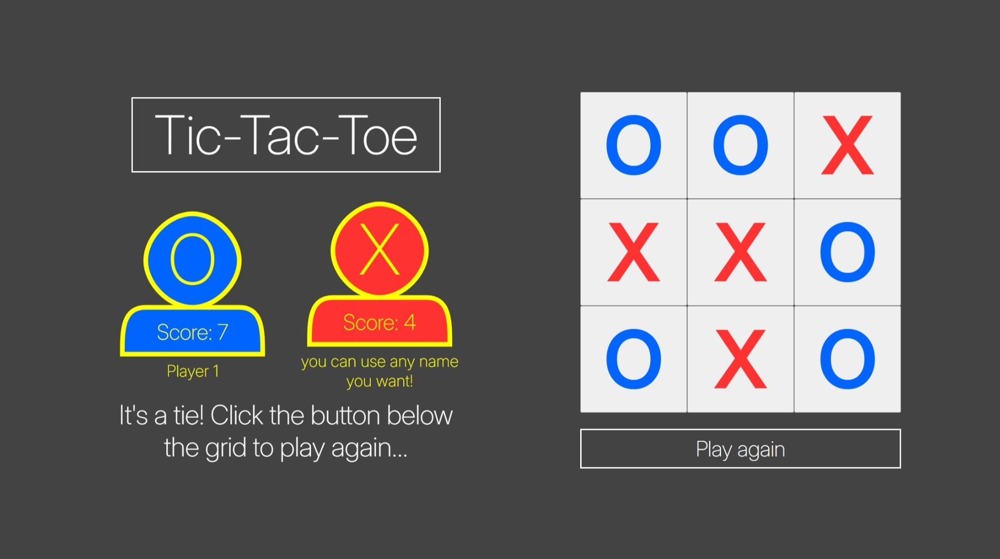
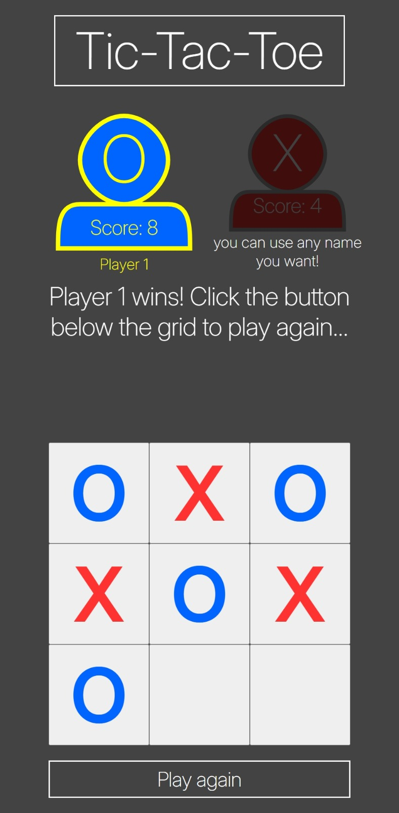

# tic-tac-toe
Tic-tac-toe project based on The Odin Project curriculum.

Live demo link: https://j0e-quan.github.io/tic-tac-toe/

## Technologies used:
 - HTML for basic page layout
 - CSS for styling elements and use of custom fonts
 - Flexbox and Grid for arranging elements
 - JavaScript for handling game logic
 - Git for version control

## Key features:
 - Game is playable on touchscreens
 - Layout adjusts to fit mobile displays
 - Intuitive icons and UI make the game easier to play

## Credits:
 - Player icons were made by me using [Yann Armelin's SVG path editor](https://yqnn.github.io/svg-path-editor/)

## Gallery:

